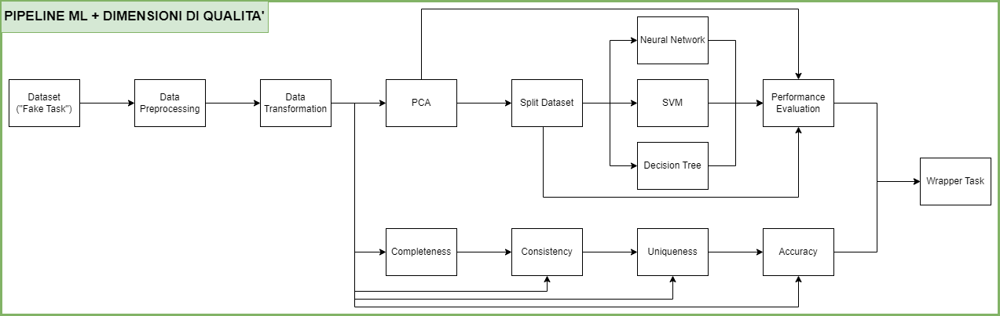
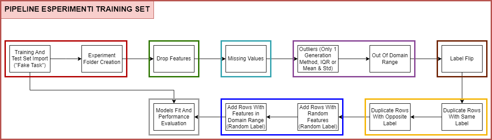

# Progetto Architetture Dati

Progetto di Architetture Dati - Data Quality \
Università degli Studi di Milano - Bicocca \
Corso di Laurea Magistrale in Informatica \
Anno Accademico 2023-2024

Per ulteriori dettagli si consulti la relazione e/o il codice.

## Autori

- Cavaleri Matteo - 875050
- Gargiulo Elio - 869184
- Piacente Cristian - 866020

## Introduzione al Dataset

Il dataset è stato selezionato con lo scopo di garantire coerenza e rilevanza nelle successive analisi condotte, utilizzando dati sensati e non fittizi.

In particolare, la scelta è stata orientata verso un insieme di dati che si prestasse ad un’analisi con Principal Component Analysis (PCA), la quale richiede una struttura dati adatta, preferibilmente con variabili numeriche continue e non nulle.

Il dataset riguarda la classificazione binaria di tipi di vini date le seguenti features (categorie), le quali descrivono la composizione chimica di un vino:
- __Fixed acidity (acido tartarico)__: Misura della quantità di acido tartarico presente nel vino, espressa in grammi per decimetro cubo (g/dm³).
- __Volatile acidity (acido acetico)__: Misura della quantità di acido acetico presente nel vino, espressa in grammi per decimetro cubo (g/dm³).
- __Citric acid (acido citrico)__: Quantità di acido citrico presente nel vino, espressa in grammi per decimetro cubo (g/dm³).
- __Residual sugar (zucchero residuo)__: Quantità di zucchero residuo nel vino, espressa in grammi per decimetro cubo (g/dm³).
- __Chlorides (cloruri)__: Concentrazione di cloruri nel vino, espressa in grammi di cloruro di sodio per decimetro cubo (g/dm³).
- __Free sulfur dioxide (anidride solforosa libera)__: Quantità di anidride solforosa libera nel vino, espressa in milligrammi per decimetro cubo (mg/dm³).
- __Total sulfur dioxide (anidride solforosa totale)__: Quantità totale di anidride solforosa presente nel vino, espressa in milligrammi per decimetro cubo (mg/dm³).
- __Density (densità)__: Densità del vino, espressa in grammi per decimetro cubo (g/dm³).
- __pH__: Misura dell'acidità o basicità del vino su una scala da 0 a 14.
- __Sulphates (solfati)__: Concentrazione di solfati nel vino, espressa in grammi di solfato di potassio per decimetro cubo (g/dm³).
- __Alcohol (alcol)__: Percentuale di alcol nel vino per volume (% vol).
- __Quality__: Qualità di un vino espressa con una valutazione da 0 a 10.

La qualità di un vino si esprime con un valore di valutazione da 0 a 10 dunque potrebbe essere considerata categorica, mentre le altre features, che sono proprietà chimiche, sono esprimibili attraverso valori continui.

## How to Run

### Setup Virtual Environment

Innanzitutto è necessario creare un Python virtual environment ed installare tutte le dipendenze.

#### Creazione e attivazione

Utilizzando la **directory principale** della repository come working directory, eseguire innanzitutto il seguente comando per **creare il virtual environment**:

    python -m venv venv

Una volta creato il virtual environment, esso verrà memorizzato nel filesystem, dunque non sarà necessario ricrearlo ogni volta.

A questo punto è possibile **attivarlo** con

    venv\Scripts\activate

#### Installazione delle dipendenze

Dopo la **prima attivazione**, è necessario **installare tutte le librerie** utilizzate tramite

    pip install -r requirements.txt

Una volta installate le dipendenze non sarà più necessario per le prossime attivazioni.
Con il virtual environment attivato, è possibile eseguire le diverse parti del progetto, descritte nelle altre sezioni.

#### Disattivazione

Quando si desidera uscire dal virtual environment, è sufficiente eseguire il comando

    deactivate

### Pipeline ML

Una delle pipeline Luigi utilizzate per il progetto si concentra su

 - **preprocessing** e **trasformazione** del dataset originale
 - creazione dello spazio della PCA
 - **training** di 3 modelli (**Neural Network, SVM, Decision Tree**) di Machine Learning sul dataset risultante dalla PCA e relativa **Performance Evaluation**
 - implementazioni di 4 dimensioni di qualità (**Completeness, Consistency, Uniqueness e Accuracy**)

Di seguito viene rappresentata la struttura contenente i vari task:

  

#### Esecuzione

Con il virtual environment attivato nella root della repository, per lanciare l'intera pipeline Luigi eseguire i seguenti comandi:

 1.     cd ml_pipeline
 2.     python -m luigi --module pipeline FullPipeline --local-scheduler

### Notebook Explainability

 Il notebook Jupyter relativo alla parte di explainability (dopo aver eseguito la prima pipeline) contiene:

 - import dei dataset e modelli prodotti dalla prima pipeline
 - analisi esplorativa, analisi con PCA, evaluation dei modelli di ML (questi tre provenienti dal progetto di Machine Learning)
 - sezione vera e propria di **explainability**.

L'idea è di sfruttare sia grafici riguardo alla creazione dello spazio della PCA (PCA Scores, Component Loading Plot, Scree Plot) sia **nuovi grafici**, in particolare

 - **Matrice di Correlazione tra Componenti PCA e Predizioni**
 - **Variable Importance**
 - **Partial Dependence Plot**
 - **SHAP**
	 - *Force Plot*
	 - *Summary Plot*
	 - *Dependence Plot*
	 - *Decision Plot*

#### Esecuzione

Con il virtual environment attivato nella root della repository, per lanciare il notebook eseguire i seguenti comandi:

 1.     cd notebooks
 2.     jupyter notebook explainability.ipynb

### Pipeline Esperimenti

La seconda pipeline Luigi riguarda invece la parte principale del progetto, ossia automatizzare l'esecuzione di diverse tipologie di esperimenti sul training set, con l'obiettivo di misurare la variazione delle performance dei modelli di ML usati rispetto alla variazione della qualità del dataset.

Le **tipologie di esperimenti** analizzati sono:

 - **Drop Features**
 - **Missing Values**
 - **Replace With Outliers**
 - **Replace With Out Of Domain Values**
 - **Flip Labels**
 - **Duplicate Rows With Same Label**
 - **Duplicate Rows With Opposite Label**
 - **Add Rows With Random Features**
 - **Add Rows With Features Within Domain Range**

Per l'esecuzione si sfruttano script Python, uno per generare un file JSON con i parametri di ciascun esperimento, uno per lanciarli tutti automaticamente e alla fine (utile per il successivo notebook Jupyter) si è deciso di riassumere tutte le metriche ottenute in un file csv.

Di seguito viene rappresentata la struttura contenente i vari task:

  

#### Esecuzione

Con il virtual environment attivato nella root della repository, per lanciare tutti e 659 gli esperimenti eseguire i seguenti comandi:

 1.     cd experiments_pipeline
 2.     python run_experiments.py 

Nota bene: l'esecuzione completa di tutti gli esperimenti potrebbe impiegare diverse ore, per questo motivo è stato lasciato il csv finale delle metriche all'interno della cartella.

### Notebook Esperimenti

 Il secondo notebook Jupyter, fondamentale per visualizzare i risultati (metriche dei modelli, sia in cross validation sia sul test set) ottenuti dall'esecuzione di tutti gli esperimenti, contiene:

 - import del csv finale contenente i risultati e del csv risultante dalla prima pipeline per avere le metriche senza "sporcare" il training set ("esperimento 0")
 - **analisi preliminare**, anche degli **esperimenti combo**
 - plot di tutti i grafici
	 - **Violin Plot per modello**
	 - **per ogni metrica**, **istogramma e scatterplot**
	 - **per ogni singolo esperimento** (e per ogni possibile parametro relativo all'esperimento), <ins>la variazione delle performance dei modelli di ML rispetto alla qualità del dataset</ins>
	 - **Matrice di Correlazione tra i diversi tipi di SVM e Neural Network** (sia con un metodo di imputazione sia senza) per misurare la **correlazione tra le metriche dei due modelli messi a confronto**

#### Esecuzione

Con il virtual environment attivato nella root della repository, per lanciare il notebook eseguire i seguenti comandi:

 1.     cd notebooks
 2.     jupyter notebook experiments.ipynb