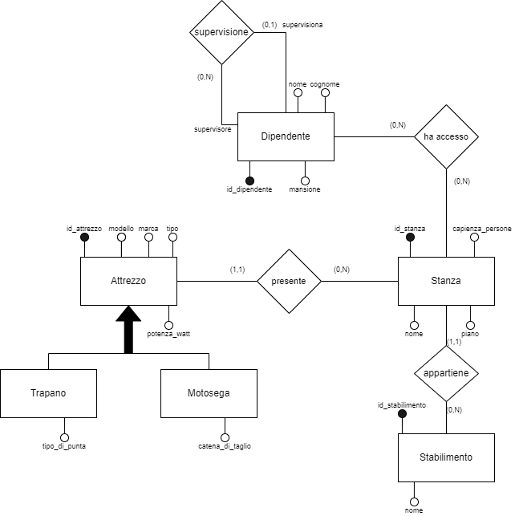
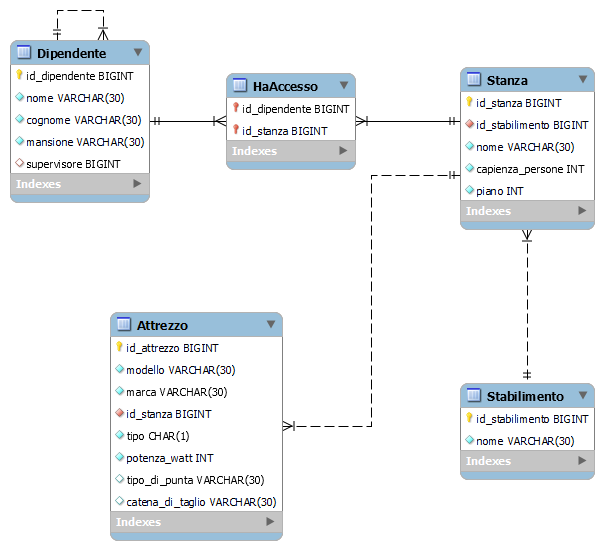

# 2023_assignment3_cpbackend

**Versione definitiva per la seconda consegna**
  
  ---

*Processo e Sviluppo del Software*

Anno Accademico 2023-24

Corso di Laurea Magistrale in Informatica

Università degli Studi di Milano-Bicocca

## Membri del gruppo

- Cristian Piacente 866020

- Matteo Cavaleri 875050

## Dominio modellato, modello ER e modello EER

Il dominio modellato riguarda un'officina che dispone di molteplici stabilimenti.

Uno **stabilimento**, che viene identificato da un id e ha un nome, possiede diverse stanze. 
Una **stanza**, identificata da un id, appartiene a uno stabilimento e possiede un nome, una capienza in termini di numero di persone e il numero del piano a cui si trova. 
In una stanza ci sono diversi attrezzi, identificati da un id.
Un **attrezzo** appartiene a una sola stanza e può essere o una **motosega** o un **trapano**. 
Entrambi i tipi di attrezzo possiedono una potenza in watt, il modello e la marca. 
Le motoseghe hanno specificata la tipologia di catena di taglio (e.g. diamantata), mentre per i trapani si ha il tipo di punta (e.g. piatta).
In una stanza hanno accesso diversi dipendenti.
Un **dipendente**, identificato da un id, può avere accesso a diverse stanze. Inoltre, possiede un nome, un cognome, una mansione e *potrebbe*  essere supervisionato da un altro dipendente.
Un dipendente può supervisionare diversi dipendenti.

Di seguito viene mostrato il modello ER seguito dal modello EER.

[Script per la creazione del DB](./CREATE_officina_SQL_query.sql)

## Classi e responsabilità

Il codice del progetto è strutturato come segue.

### Sorgenti applicazione (src/main/java)

#### net.cpbackend

OfficinaManagerApplication.java permette di eseguire il progetto come Java Application se si desidera utilizzare gli endpoint forniti dai controller.

Un client (un utente, tramite un tool come Postman) effettua una richiesta tramite uno degli endpoint REST gestiti da uno specifico controller, quest'ultimo smista la richiesta alla classe service che se ne occupa, infine essa implementa della logica appoggiandosi a un repository che permette di effettuare operazioni CRUD con il database.

#### net.cpbackend.controller

L'URL di base è http://localhost:8080/officina e a partire da esso ciascun controller (uno per ogni entity) gestisce richieste a seconda dello specifico mapping. Tutti i controller hanno una struttura comune, che consente di effettuare operazioni CRUD per l'entity di cui si occupa.

Inoltre, il controller corrispondente all'entity Attrezzo fornisce anche la possibilità di effettuare una **search operation** all'URL /officina/attrezzi/search/{tipo}/{potenza}/{piano}, in cui {tipo}, {potenza} e {piano} sono parametri, rispettivamente sono il tipo di un attrezzo che si vuole ricercare (M oppure T), la potenza minima in Watt (e.g. 1500) e il numero del piano della stanza in cui si trova.

Di seguito vi è riportato un esempio di endpoint resi disponibili, per chiarirne la struttura comune. 
Per dettagli si faccia riferimento al codice dello strato service.

*StabilimentoController*

 - **POST** /officina/stabilimenti

    Nel body della richiesta viene passato lo stabilimento da creare.
    Nel body della risposta si ha l'entity corrispondente allo stabilimento creato.

 - **GET** /officina/stabilimenti/{id}

    Come parametro URL viene passato l'ID dello stabilimento da recuperare.
    Nel body della risposta si ha l'entity corrispondente allo stabilimento trovato.

 - **GET** /officina/stabilimenti

    Nel body della risposta si ha una lista di entity corrispondenti agli stabilimenti memorizzati nel DB.

 - **PUT** /officina/stabilimenti/{id}

    Come parametro URL viene passato l'ID dello stabilimento da aggiornare, mentre nel body della richiesta viene passata l'entity aggiornata con i nuovi dati. Si può evitare di passare l'ID anche nel body della richiesta, tuttavia se viene passato deve corrispondere al parametro URL.
    Nel body della risposta si ha l'entity corrispondente allo stabilimento in seguito all'aggiornamento.

 - **DELETE** /officina/stabilimenti/{id}

    Come parametro URL viene passato l'ID dello stabilimento da eliminare.
    Nel body della risposta si ha l'entity corrispondente allo stabilimento eliminato.

#### net.cpbackend.deserialize

La deserializzazione di un'entity figlia di Attrezzo (da JSON) viene gestita tramite un custom deserializer (AttrezzoDeserializer.java) configurato nell'object mapper (JacksonConfiguration.java): il funzionamento si basa sulla lettura del tipo passato.

#### net.cpbackend.model

In questo package si hanno le seguenti entity: Attrezzo, Dipendente, Motosega, Stabilimento, Stanza, Trapano.

Tutte le relazioni sono state mappate in maniera monodirezionale, tenendo il riferimento a una singola entity (tranne per la many to many, che deve appoggiarsi su una collection).

Attrezzo è la superclasse utilizzata nella gerarchia ed è una classe abstract, quindi non istanziabile. L'attributo che discrimina il tipo è un char ed assume valore 'M' per la sottoclasse Motosega mentre 'T' per un Trapano. 

Si consulti il commento sul codice per ulteriori dettagli sulle scelte implementative.

#### net.cpbackend.model.id

Questo package contiene solo l'interfaccia Identifiable, che contiene queste due signature:

    public Long getId();
    public void setId(Long id);

#### net.cpbackend.repository

Una serie di interfacce estendono CrudRepository: interfaccia gestita da Spring che offre diversi metodi per operazioni CRUD.

Si tratta dell'ultimo strato, preceduto da service, poiché si svolgono operazioni CRUD sul DB.

#### net.cpbackend.service

Service è lo strato intermedio tra controller e repository (Controller -> Service -> Repository): le richieste arrivano dal controller e per gestirle ci si appoggia sulle operazioni fornite da repository.

È stata definita una classe abstract BaseCrudService che fornisce una logica "globale" per ogni entity, per i metodi CRUD implementati. 

Ciascuna classe service offre i metodi create, findById, findAll, update e deleteById, mentre AttrezzoService fornisce anche il metodo search.

### Sorgenti test (src/test/java)

#### net.cpbackend

Questo package non contiene nulla di rilevante.

Sono invece rilevanti gli altri package che sono raggruppamenti logici di test JUnit per la stessa entity. Per brevità viene descritto solo un package, in quanto gli altri presentano la stessa struttura (a meno di search operation e nomi di classi/metodi).

#### net.cpbackend.attrezzo

Sono presenti 3 classi:

 - **AttrezzoTest**: in un metodo @BeforeEach si inizializza il DB con dati validi, nel metodo @AfterEach si ripulisce il DB e ci sono due metodi @Test che sfruttano questi dati, ossia findById e updateAttrezzo.
 - **InvalidAttrezzoTest**: si tratta della classe che non utilizza il DB (e di conseguenza non ha metodi @BeforeEach e @AfterEach) in quanto testa il passaggio di dati non validi nei metodi createAttrezzoInvalidData, findByIdNotFound, updateAttrezzoInvalidData, updateAttrezzoNotFound, deleteAttrezzoNotFound, searchAttrezzoInvalidData.
 - **SearchFindAllAttrezzi**: anche questa classe si appoggia al DB (e quindi gestisce la creazione e la pulizia dei dati con @BeforeEach e @AfterEach) ed implementa i metodi @Test search e findAll.

#### net.cpbackend.dipendente (non descritto per brevità)

#### net.cpbackend.stabilimento (non descritto per brevità)

#### net.cpbackend.stanza (non descritto per brevità)

## Manuale di installazione ed utilizzo

### Prerequisiti e breve introduzione sui tool

Il progetto è stato testato su Windows x64 con queste versioni specifiche installate:

 - MySQL 8.0.34 ([download MySQL installer 8.0.34 per Windows x86](https://downloads.mysql.com/archives/get/p/25/file/mysql-installer-community-8.0.34.0.msi) da cui è possibile installare **MySQL Server** e **MySQL Workbench**)
 - [**Eclipse** 2021-03 (4.19.0)](https://www.eclipse.org/downloads/download.php?file=/technology/epp/downloads/release/2021-03/R/eclipse-java-2021-03-R-win32-x86_64.zip) 
 - [JDK 17.0.1 (64-bit)](https://download.oracle.com/java/17/archive/jdk-17.0.1_windows-x64_bin.exe)
 
L'ORM framework utilizzato è Spring Data JPA, come database per avere la persistenza dei dati viene usato MySQL, mentre JUnit per eseguire casi di test.

### Installazione ed utilizzo

Come step 0, assicurarsi di avere a disposizione l'hosting di un server MySQL.

All'inizio si deve **clonare la repository** da git e in seguito selezionare la cartella come **workspace** di Eclipse, ma prima di proseguire è importante **sistemare il file di configurazione**.

In src/main/resources il file **application.example.properties** contiene i valori di default (host **localhost**, porta **3306**, **root** sia come **username** sia come **password**): è necessario ricopiare il contenuto in un file **application.properties** e adeguare la configurazione in base alla propria macchina.

A questo punto, nel Package Explorer sulla sinistra cliccare su **Import projects...** e scegliere Maven -> **Existing Maven Projects**.

Come Root Directory indicare la cartella clonata in precedenza, che corrisponde anche al workspace.

Serve anche specificare il **path** dell'installazione di **Java 17** all'interno di Window -> Preferences -> Java -> Compiler -> Installed JREs:

 - Cliccare su Add
 - Scegliere Standard VM
 - Come JRE home selezionare (dal bottone Directory...) il path di installazione di JDK 17, come %programfiles%\Java\jdk-17.0.1
 - Dopo aver cliccato su Finish, abilitare jdk-17.0.1 ed eliminare (con Remove) le altre definizioni di JRE.

(Dopo aver fatto Apply and Close, a seconda della versione di Eclipse potrebbe non essere disponibile il Compiler compliance level 17 in Window -> Preferences -> Java -> Compiler; tuttavia, è stato testato il livello 15 con JDK 17.0.1 ed è possibile ignorare il warning)

Prima di poter eseguire correttamente il progetto, è necessario creare il **database officina** e le relative tabelle sul server MySQL ([script per la creazione del DB](./CREATE_officina_SQL_query.sql)).

A questo punto è possibile lanciare la Spring Application oppure i test JUnit.

#### Spring Application

Per eseguire il progetto è sufficiente lanciare net.cpbackend.**OfficinaManagerApplication.java** come Java Application (Run As -> Java Application): Spring Boot si occuperà di inizializzare Tomcat sulla porta 8080.

Si rimanda alle sezioni precedenti per i dettagli.

#### Test JUnit

È possibile lanciare i test JUnit singolarmente, che si trovano nei package definiti in src/test/java.

Selezionando una classe Test ed eseguendola come test JUnit (Run As -> JUnit test), in automatico viene eseguita l'applicazione e vengono lanciati tutti i test definiti in quella classe.

Si rimanda alle sezioni precedenti per i dettagli.